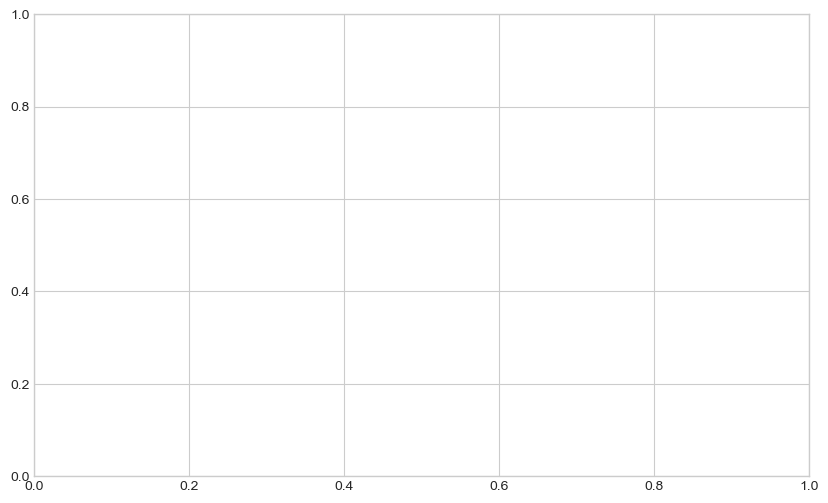

# Test notebook


```python
import numpy as np
import pandas as pd
import matplotlib.pyplot as plt

plt.style.use("seaborn-whitegrid")
```

    /var/folders/ky/4qby95090jbbq38_mh94x72r0000gn/T/ipykernel_16681/4221165740.py:5: MatplotlibDeprecationWarning: The seaborn styles shipped by Matplotlib are deprecated since 3.6, as they no longer correspond to the styles shipped by seaborn. However, they will remain available as 'seaborn-v0_8-<style>'. Alternatively, directly use the seaborn API instead.
      plt.style.use("seaborn-whitegrid")


Cell:


```python
import pandas as pd

if True:
    val = 2

print(val)
```

    2


change


```python
a = 1
b = 3
```


```python
c = 5 - 9
```


```python
fig, ax = plt.subplots(figsize=(10, 6))
fig.show()
```

    /var/folders/ky/4qby95090jbbq38_mh94x72r0000gn/T/ipykernel_16681/3381400113.py:2: UserWarning: Matplotlib is currently using module://matplotlib_inline.backend_inline, which is a non-GUI backend, so cannot show the figure.
      fig.show()


    

    

